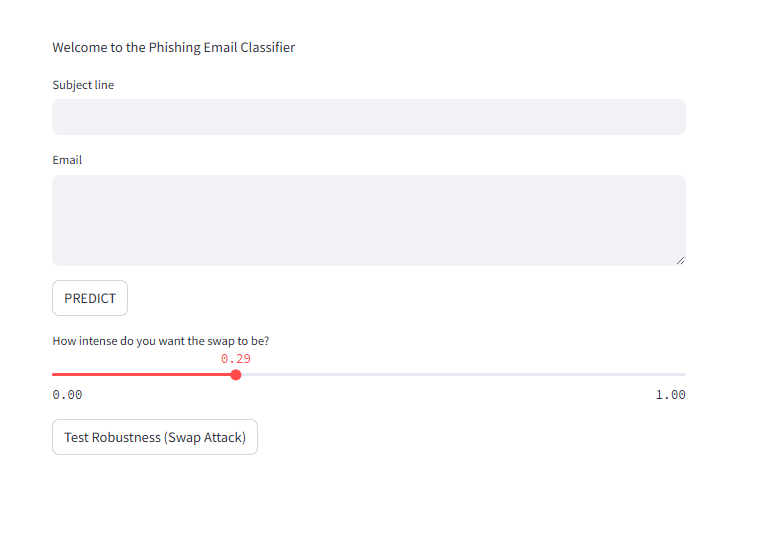

# 🛡️ Adversarial Phishing Detection

This interactive web application allows users to paste in emails and receive real-time predictions on whether the email is phishing or legitimate, powered by a fine-tuned BERT model. The app also features an educational adversarial attack simulator to demonstrate how AI can be manipulated with subtle word swaps.

---
## 📦 Dataset Used

Source: [Phishing Email Dataset – Kaggle](https://www.kaggle.com/datasets/naserabdullahalam/phishing-email-dataset)

## 🚀 Features

- ✅ Predict if an email is phishing or legitimate using a trained BERT model
- 🔍 Generate natural language explanations for each prediction using Gemini API
- ⚔️ Simulate adversarial attacks (e.g. word swaps) and test model robustness
- 📊 Educational tool for exploring NLP model sensitivity
- 🧠 Simple UI built with Streamlit for easy interaction

---

## 🧰 Tech Stack

- **Frontend**: Streamlit  
- **Model**: BERT
- **Adversarial NLP**: [TextAttack](https://github.com/QData/TextAttack) 
- **Generative Explanations**: Gemini API  
- **Storage**: Hugging Face Hub 
- **Deployment**: Streamlit Cloud  

---
